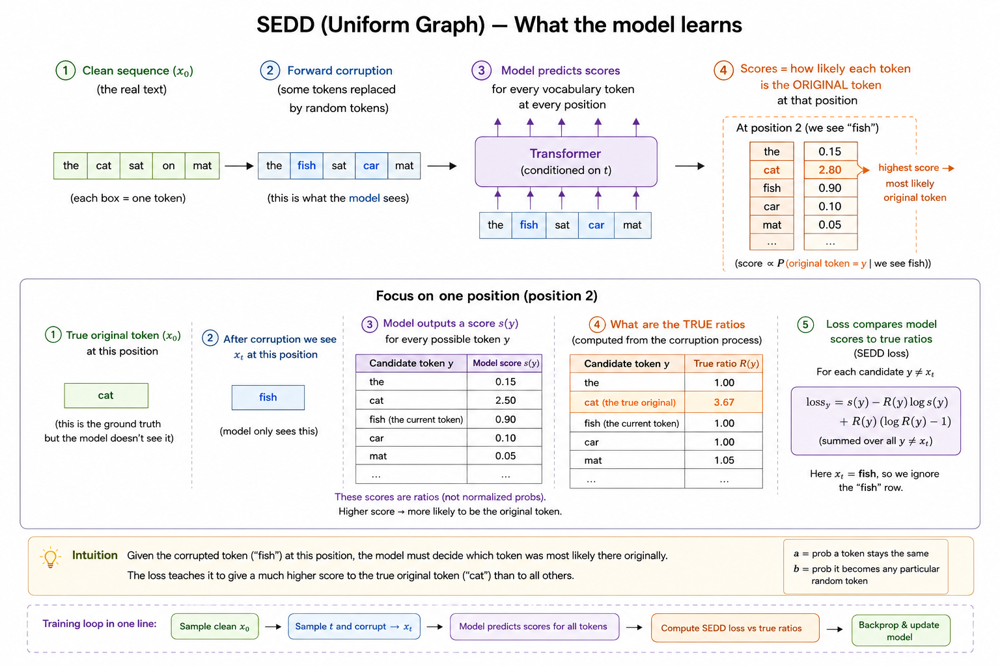

# Uniform Text Diffusion Transformer

This is a small text diffusion model. It learns to write short children's stories. The first version is named `TON-v1`.

It is built on the SEDD idea (Score Entropy Discrete Diffusion, paper [2310.16834](https://arxiv.org/pdf/2310.16834)). It uses the **uniform** version, not the absorbing/mask version.



## What it does 

Will write up a detailed article on how the math works later. Following is a very rough idea. Normal language models write one word, then the next, then the next, left to right (autoregressive, causal attention). This model does not do that.

Instead it works like cleaning up a noisy picture:

1. Start with a line of pure random words. Total nonsense.
2. Look at the whole line at once and guess which words are wrong.
3. Replace some of the wrong words with better ones.
4. Repeat this many times.
5. After all the steps you are left with a real story.

So the model does not build a sentence from scratch. It starts with garbage and slowly fixes it until it reads like English.

## How the "uniform" part works

During training we take a real story and add noise to it. Adding noise means we randomly swap some of its words for completely random words. The more noise we add, the more words get swapped.

"Uniform" means any word can be swapped for any other word with equal chance. There is no special blank or mask token. This is the part that makes it different from the more common absorbing version.

The model is then trained to undo this swapping. It learns, for each spot in the text, how likely every other word is to be the correct one. That is what the loss function (denoising score entropy) measures.

## The model itself

- A plain Transformer, 8 layers, 512 hidden size, 8 attention heads.
- Around 77 million parameters.
- Attention is **bidirectional**, meaning every word can look at every other word, both left and right. A normal GPT can only look left.
- It also takes the noise level as an input, so it knows how messy the current text is.
- Vocabulary is the GPT-2 tokenizer, about 50,257 tokens. (Working on coming up with a tokenizer for this model, GPT-2 tokenizer is borderline overkill for this model)

## The data

It trains on `karpathy/tinystories-gpt4-clean`, a set of very simple short stories written for small children. We use about 100 million tokens. The text is tokenized once and saved to `tinystories_gpt2.bin` so we do not have to redo it every run.

## Training details

- Runs on CUDA (tested on an RTX 4060 Laptop, 8 GB).
- Batch size 16, context length 128 tokens.
- Learning rate warms up for 300 steps then cools down on a cosine curve.
- Saves a checkpoint to `ckpt.pt` every 1000 steps.
- If `ckpt.pt` already exists, the script picks up where it left off.
- It times every part of every step (data loading, loss, backward, optimizer) and prints it.

## Files

- `ton-v1.py` is the whole thing: data, model, training, and sampling.
- `analyze_gemma.py` - code to analyze DiffusionGemma model by Google DeepMind
- `diffusionGemma_layers.json` - layers of the diffusionGemma model (only the diffusion transformer part)

## Commands

You need a venv with PyTorch (CUDA), tiktoken, datasets, and matplotlib installed.

Train (this also resumes automatically if `ckpt.pt` is present):

```
conda activate <env_name>
python ton-v1.py
```

Inference happens at the end of the same script. After training finishes it starts from random noise, runs the denoising steps, and prints one generated story. The loss curve is saved to `loss.png`.
