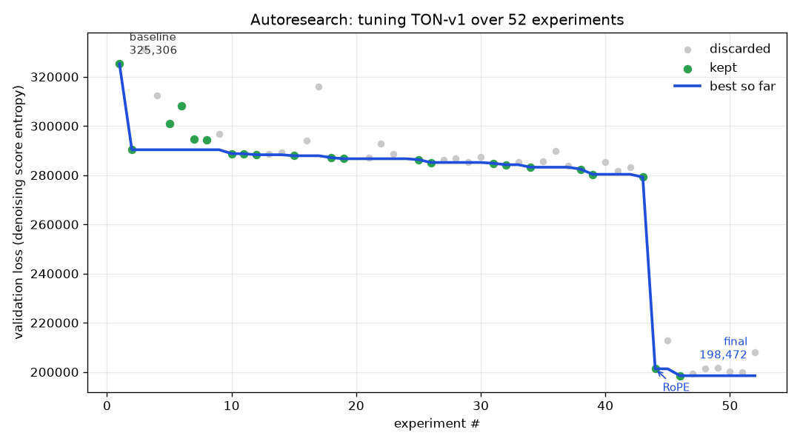
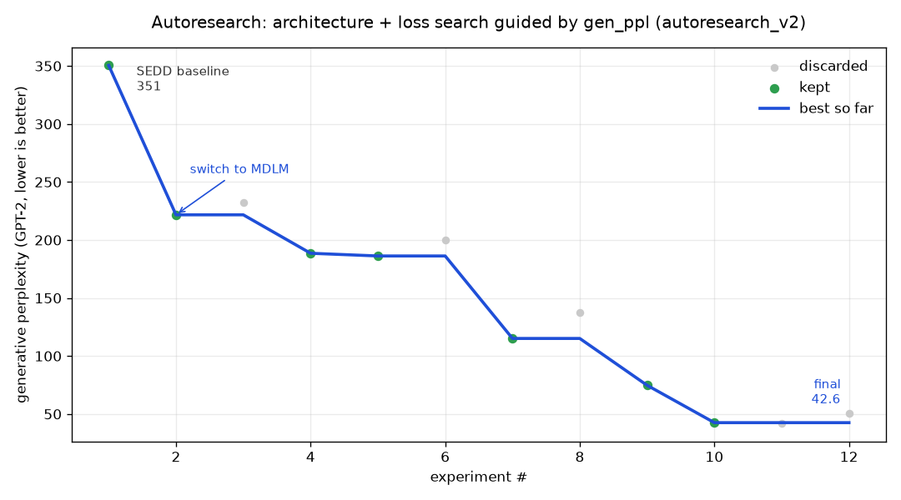

# TON-v1: Text Diffusion Transformer

This repo is a small text diffusion model that learns to write short children's stories, tuned by an autonomous agent instead of by hand. We've run it as two separate experiments, each with its own loss function and its own autoresearch run:

- **`diffusion_sedd/`**, built on **SEDD** (Score Entropy Discrete Diffusion, uniform variant), paper [2310.16834](https://arxiv.org/abs/2310.16834), the original version.
- **`diffusion_mdlm/`**, built on **MDLM** (Masked Diffusion Language Models, absorbing variant), paper [2406.07524](https://arxiv.org/abs/2406.07524), a follow-up that swapped the loss function and beat SEDD by a wide margin.

Both live in this one repo so they're easy to compare side by side. If you just want the short version: same architecture family, different noise/loss formulation, MDLM produces noticeably more fluent stories for the same training budget.

## What text diffusion does

Normal language models write one word, then the next, then the next, left to right (autoregressive, causal attention). This model does not do that.

Instead it works like cleaning up a noisy picture:

1. Start with a line of pure random (or fully masked) tokens. Total nonsense.
2. Look at the whole line at once and guess which words are wrong.
3. Replace some of the wrong words with better ones.
4. Repeat this many times.
5. After all the steps you are left with a real story.

So the model does not build a sentence from scratch, left to right. It starts with garbage (or blanks) and slowly fixes it until it reads like English. Both SEDD and MDLM follow this same idea, they just disagree on *how* to corrupt the text during training and what the loss should measure.

## SEDD vs MDLM

SEDD (`diffusion_sedd/`) corrupts a story by randomly swapping words for other random words from the vocabulary, with no special blank token, and trains the model to estimate a ratio of probabilities between the corrupted and true word at every position (denoising score entropy). MDLM (`diffusion_mdlm/`) corrupts a story by replacing words with a single `[MASK]` token (the more common "absorbing" diffusion setup) and trains with a much simpler, more standard weighted cross-entropy loss over just the masked positions.

Both use the exact same backbone: a 6-layer, 512-hidden, 16-head bidirectional Transformer (~77M params) with RoPE position embeddings, adaLN time conditioning, and QK-norm, so the comparison is really about the corruption process and loss, not the architecture. On paper MDLM has a simpler, better-understood objective (it's basically the standard masked-LM cross-entropy with a time-dependent weight), and that showed up immediately: switching the loss function in place, with nothing else changed, cut generative perplexity roughly in half in the very first experiment of the second autoresearch run.

Because the two losses aren't on the same numeric scale (DWDSE score-entropy vs weighted cross-entropy), comparing raw validation loss between them is meaningless. That's why the second autoresearch run switched to judging experiments by **generative perplexity under GPT-2** plus a **distinct-2 diversity** guardrail (to catch a model that games low perplexity by repeating itself), instead of validation loss.

The difference shows up clearly in the generated text. SEDD's samples (see `diffusion_sedd/generated_samples_73k.txt`) are readable but grammatically rough, with dropped words and odd phrasing throughout even after 75k steps. MDLM's samples (see `diffusion_mdlm/generated_samples_mdlm.txt`) are full, grammatical sentences with a real story shape, and its final generative perplexity (24.75) lands right around what real TinyStories text scores under the same GPT-2 model (about 30-50).

## Autoresearch: what worked, what didn't

Neither model was tuned by hand. Following Karpathy's [autoresearch](https://github.com/karpathy/autoresearch) idea, an autonomous loop repeatedly edits the training script, trains for a fixed time budget on an RTX 4060 laptop GPU, reads back a metric, and keeps the change only if the metric improved (otherwise it reverts and tries something else).

### SEDD run (`diffusion_sedd/`, 5-minute budget per experiment)



Guided by validation loss. Over **52 experiments (22 kept)** it drove val loss from **325k down to 198k, about a 39% improvement**, entirely on its own. Most of the early gains came from speed hacks that simply let the step-starved model train more in the fixed budget: TF32, fused flash-attention, a bf16 pass, and a closed-form rewrite of the score-entropy loss, followed by a run of small architecture wins (QK-norm, sinusoidal + adaLN time conditioning, 16 heads, 6 layers). The single biggest find was swapping the learned position embedding for RoPE, which cut the loss by ~28% in one shot. Dead ends it correctly walked away from: bigger models, weight tying, SwiGLU, importance sampling. Every experiment, kept or not, is logged with a one-line reason in `diffusion_sedd/results.tsv`.

### MDLM run (`diffusion_mdlm/`, 10-minute budget per experiment)



This run started from scratch architecturally, trying different diffusion formulations entirely rather than just tuning the SEDD setup further, and was guided by generative perplexity (+ distinct-2 as a guardrail) instead of loss, for the reason above. Over **12 experiments (7 kept)** it took the tuned SEDD baseline (gen_ppl 350.5) down to **gen_ppl 42.6, an 8x improvement**. What worked: switching to MDLM's masked/absorbing formulation (350 to 222 in one change), tuning the learning rate up to 3e-3, using 256 sampling steps instead of 128 or 512 (finer unmasking, the single biggest win: 186 to 115), and top-k=20 filtered sampling to drop the low-probability tail during generation (115 to 43). What didn't: 12 transformer layers (worse, the model is step-bound not capacity-bound), a 512-step sampler (over-fine, worse than 256), top-k=10 (tied on perplexity but visibly hurt diversity and got flagged by the distinct-2 guardrail, so it was correctly discarded), and dropping the adaLN time-conditioning (worse despite the extra sampling steps). Full log in `diffusion_mdlm/results_v2.tsv`.

The best MDLM config was then trained fully (not time-boxed) for 100,000 steps on the complete ~540M-token dataset, saving a checkpoint whenever validation loss beat every prior evaluation, and reached a final gen_ppl of 24.75.

## The data

Both models train on `karpathy/tinystories-gpt4-clean`, a set of very simple short stories written for small children. The full corpus is about 540 million tokens, tokenized once with the GPT-2 tokenizer and cached to `tinystories_gpt2_full.bin` at the repo root (shared by both experiments) so it doesn't need to be rebuilt per run. The autoresearch loops themselves used a smaller token slice for speed; the full training runs used the whole thing.

## Files

- `diffusion_sedd/` and `diffusion_mdlm/` each contain their own copy of the model script (`ton-v1-sedd.py` / `ton-v1-mdlm.py`), generation script (`gen.py` / `gen_mdlm.py`), inference benchmark script (`bench_gen.py` / `bench_gen_mdlm.py`), autoresearch plotting script (`plot_progress.py` / `plot_progress_mdlm.py`), experiment log (`results.tsv` / `results_v2.tsv`), autoresearch progress graph, training loss curve, generated story samples, timing benchmark JSON, and best model checkpoint.
- `tinystories_gpt2_full.bin` at the repo root is the tokenized dataset, shared by both folders.
- `analyze_gemma.py` / `diffusionGemma_layers.json` are unrelated: notes from analyzing Google DeepMind's DiffusionGemma model.

If you want inference timings, memory usage, or the raw sample outputs for either experiment, they're in that experiment's folder: `diffusion_sedd/gen_timing.json` and `diffusion_mdlm/gen_timing_mdlm.json` for benchmarks, `generated_samples*.txt` for stories.

## Commands

You need a venv with PyTorch (CUDA), tiktoken, datasets, numpy, matplotlib, and transformers installed.

Both scripts expect to be run from inside their own folder (so they find the shared dataset cache one directory up, and save checkpoints locally).

**SEDD:**

```
cd diffusion_sedd
python ton-v1-sedd.py       # train (resumes automatically from ckpt_full.pt if present)
python gen.py                # generate stories from ckpt_full.pt
python bench_gen.py           # benchmark generation timing/memory -> gen_timing.json
```

**MDLM:**

```
cd diffusion_mdlm
python ton-v1-mdlm.py       # train (resumes automatically from ckpt_mdlm.pt if present)
python gen_mdlm.py           # generate stories from ckpt_mdlm_best.pt
python bench_gen_mdlm.py      # benchmark generation timing/memory -> gen_timing_mdlm.json
```

Both training scripts print inference at the end of the run (starting from random noise or all-`[MASK]`, running the denoising steps, printing one generated story) and save a loss curve.
